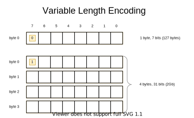

- [Introduction](#introduction)
- [Supported Types](#supported-types)
    - [BYTE, UBYTE](#byte)
    - [BYTEARRAY](#bytearray)
    - [STRING](#string)
    - [BOOLEAN](#boolean)
    - [BITSET8](#bitset8)
    - [SHORT, USHORT, INT, UINT, LONG, ULONG](#short-int-long)
    - [FLOAT, DOUBLE](#float-double)
    - [ENUM8 and ENUM16](#enum8-and-enum16)
    - [OBJECT](#object)
    - [List types](#list-types)
    - [MAP](#map)
- [Variable Length Encoding](#variable-length-encoding)

<a name="introduction"></a> 
## Introduction

**Protokol** is a simple Kotlin Multiplatfrom library for data serialization that allows for efficient binary encoding.
**Protokol** only supports serialization of mutable class properties and uses reflection API for access.

Using Multiplatfrom Kotlin to define model classes in combination with **Protokol** for data serialization enables
creation of multiplatform libraries of business logic that can be used in wide range of applications written in
different languages across many platforms (e.g. JavaScript/TypeScript in browser or Node.js, Java/Kotlin on JVM,
C++/Swift/ObjectiveC on native platforms such as Android, iOS, MacOS, Linux or Windows).     

To achieve efficient data encoding **Protokol** employs the concept of _dynamic format_ where values of previously
(de)serialized fields may affect the serialization format of the fields that follow (in this document, Kotlin class
properties often be referred as _fields_).
To define the logic of such serialization format **Protokol** offers type-safe DSL.

**Protokol** supports serialization of basic Kotlin types such as: `Byte`, `UByte`, `ByteArray`, `String`,
`Boolean`, `Short`, `UShort`, `Int`, `UInt` `Long`, `ULong`, `Float`, `Double` and `Enum`.
Also supported are aggregate types such as `List<T>`, `Map<K, V>` and `OBJECT` (i.e. field of any type which class
has defined **Protokol** serialization). Lastly, **Protokol** has special support for bitsets of 8 bits.

Here's an example of using **Protokol** to serialize simple `Result` class:

```Kotlin
data class Result(
    var errCode: Int = 0,
    var errText: String = "",
    var value: Boolean = false
)

object ResultProtokolObject : ProtokolObject<Result> {
    override val protokol: Protokol.(Result) -> Unit = {
        with(it) {
            // Protokol DSL starts
            INT(::errCode)
            if (errCode > 0) {
                STRING(::errText)
            } else {
                BOOLEAN(::value)
            }
        }
    }

    override fun create() = Result()
}

fun main() {
    val result = Result(value = true)
    val bytes: ByteArray = ByteArrayProtokolCodec.encode(result, ResultProtokolObject)
    println("bytes array size: ${bytes.size}")
    val decodedResult: Result = ByteArrayProtokolCodec.decode(bytes, ResultProtokolObject)
    println(decodedResult)

    val errResult = Result(errCode = 1, errText = "Result error")
    val errBytes: ByteArray = ByteArrayProtokolCodec.encode(errResult, ResultProtokolObject)
    println("errBytes array size: ${errBytes.size}")
    val decodedErrResult: Result = ByteArrayProtokolCodec.decode(errBytes, ResultProtokolObject)
    println(decodedErrResult)
}
```

Program's output:

```
bytes array size: 5
Result(errCode=0, errText=, value=true)
errBytes array size: 17
Result(errCode=1, errText=Result error, value=false)
```

For `Result` class to support **Protokol** serialization all that is needed is to implement `ProtokolObject<Result>`
interface as Kotlin object class. With `ResultProtokolObject` implementation, the **Protokol**'s provided
`ByteArrayProtokolCodec` can be used to encode (serialize) instance of `Result` to bytes, and to decode
(deserialize) from bytes to a new instance of `Result` (in this document the terms _serialize_, _compose_ and
_encode_, as well as _deserialize_, _parse_ and _decode_ are used interchangeably).

`ProtokolObject` interface as defined as:

```Kotlin
interface ProtokolObject<T> {
    val protokol: Protokol.(T) -> Unit
  
    fun create(): T
}
```

The `create(): T` method is used when deserializing to create a new instance of `T`.
The `protokol` abstract property is used to provide **Protokol** format definition.
The combination of Kotlin's lambda with receiver (for implicit reference to instance of `Protokol`) and `with(it)` for
implicit reference to instance of `T`, as well as `::` operator to reference property of `T` as `KMutableProperty0`
allows to express serialization format's logic as DSL-like code:

```Kotlin
INT(::errCode)
if (errCode > 0) {
    STRING(::errText)
} else {
    BOOLEAN(::value)
}
``` 

The code above defines serialization format as: first goes an "`Int` value bound to `Result.errCode` property";
after goes either a "`String` value bound to `Result.errText` property" or a "`Boolean` value bound to
`Result.value` property" conditional on `errCode` is a positive number or not.

Important feature of **Protokol**'s DSL is its applicability in both serialization and deserialization contexts.
This is possible because of `::` operator and Kotlin's reflection API. Applied to a property `::` returns an instance
of `KMutableProperty0<V>` type. Reference to an instance of `KMutableProperty0<V>` allows for serialization code to
_get_ property's value, and for deserialization code to _set_ property's value.

In **Protokol** DSL, any type declaration clause can optionally be given `(T) -> Unit` lambda to perform validation of
the property's value. For invalid values lambda can throw the exception to stop further (de)serialization.
During serialization such lambda will be called with property's value as an argument before it will be serialized.
When deserializing this lambda will be called with deserialized value before it will be set to a property.

This is how **Protokol** enforces non-negative values of `errCode: Int` by providing validation lambda:

```Kotlin
INT(::errCode) { errorCode -> if (errorCode < 0) throw IllegalArgumentException("errCode can't be negative: $errorCode") }
if (errCode > 0) {
    STRING(::errText)
} else {
    BOOLEAN(::value)
}
```

<a name="supported-types"></a> 
## Supported Types

<a name="byte"></a> 
### BYTE, UBYTE

Declaration of **Protokol**'s `BYTE` type serializes bound property of `Byte` type directly to a single byte.
UBYTE declaration does the same for `UByte` (Unsigned Byte) type.

Here's an example of binding `b: Byte` property as **Protokol**'s `BYTE` with optional validation lambda:

```Kotlin
BYTE(::b) { value -> if (value.toInt() == 0) throw IllegalArgumentException("zero is not allowed") }
```

and binding of `ubyte: UByte` property as **Protokol**'s `UBYTE`

```Kotlin
UBYTE(::ubyte) { value -> if (value == UByte.MAX_VALUE) throw IllegalArgumentException("255 is not allowed") }
```

<a name="bytearray"></a> 
### BYTEARRAY

Similar to `BYTE`, **Protokol**'s `BYTEARRAY` type serializes a property of `ByteArray` type directly to an array of bytes.
But there's an important difference - array's size must also be encoded and appended to actual data bytes.
Having size of data allows parser to know how many bytes to parse, and also to create a properly sized array to have
them copied into. To encode an integer number of array's size **Protokol** uses a technique called
[Variable Length Encoding](#variable-length-encoding) (VLE for short).
**Protokol** also uses VLE for a variety of its `List<T>` types as well as 'MAP<K, V>' to encode collection's size.
VLE limits the maximum size of `ByteArray` to 2Gb.

This is how you bind `bytes: ByteArray` property as **Protokol**'s `BYTEARRAY`:

```Kotlin
BYTEARRAY(::bytes)
```

and with optional validation lambda:

```Kotlin
BYTEARRAY(::bytes) { array ->
  if (array.size > 1024) throw IllegalArgumentException("bytes size can't be more than 1024")
}
```

<a name="string"></a> 
### STRING

**Protokol**'s `STRING` type serializes `String` property as `ByteArray` assuming UTF-8 encoding.
Because of this `String` and `ByteArray` share the same encoding and limits. Specifically, maximum size of
`String` (in bytes) as imposed by [Variable Length Encoding](#variable-length-encoding) is 2Gb.

The example below shows how to bind `str: String` property as **Protokol**'s `STRING` with optional validation lambda:

```Kotlin
STRING(::str) { value -> if (value.endsWith("ism")) throw IllegalArgumentException("Toxic!") }
```

<a name="boolean"></a> 
### BOOLEAN

Properties of `Boolean` type can be serialized using **Protokol**'s `BOOLEAN` type declaration. `BOOLEAN` encodes
boolean value as a single byte: `0` for `false` and `1` for `true`. In the case of a class with many `Boolean`
properties to be serialized you may consider using **Protokol**'s `BITSET8` type that allows using individual bits
to represent boolean values.

This is how you declare **Protokol**'s `BOOLEAN` for `b: Boolean` property:

```Kotlin
BOOLEAN(::b)
```

or with optional validation lambda:

```Kotlin
BOOLEAN(::b) { value -> if (value) throw IllegalArgumentException("Only 'false' value is allowed") }
```

<a name="bitset8"></a> 
### BITSET8

**Protokol** allows serializing a `Boolean` field as a specific bit of a single byte using `BITSET8` type declaration.

In the following example `BitsResult` class has three `Boolean` fields that will be serialized as bits #0, #1 and #5:

```Kotlin
data class BitsResult(
    var errCode: Int = 0,
    var errText: String = "",
    var flagA: Boolean = false, // bit #0
    var flagB: Boolean = false, // bit #1
    var flagC: Boolean = false  // bit #5
)

object BitsResultProtokolObject : ProtokolObject<BitsResult> {
    override val protokol: Protokol.(BitsResult) -> Unit = {
        with(it) {
            // Protokol DSL starts
            INT(::errCode)
            if (errCode > 0) {
                STRING(::errText)
            } else {
                BITSET8(::flagA, ::flagB, b5 = ::flagC)
            }
        }
    }

    override fun create() = BitsResult()
}
```

`BITSET8` can be useful not only for compressing `Boolean` fields into fewer bytes of serialized data, but also for
supporting (parsing) existing binary formats that make use of individual bits.

<a name="short-int-long"></a>
### SHORT, USHORT, INT, UINT, LONG, ULONG

Properties of `Short` (16-bit signed integer), `Int` (32-bit signed integer) and `Long` (64-bit signed integer) types,
as well as their unsigned variants,
can be serialized using **Protokol**'s respective `SHORT`, `INT` and `LONG` (or `USHORT`, `UINT` and `ULONG` for
unsigned) type declarations. Bytes representing integers (2 bytes for `Short` and `UShort`, 4 bytes for `Int` and
`UInt` and 8 bytes for `Long` and `ULong`) are big-endian encoded.

The following example shows **Protokol** declarations for `s: Short`, `i: Int` and `l: Long` properties, complemented
by optional validation code:

```Kotlin
SHORT(::s) { value -> if (value.toInt() == 0) throw IllegalArgumentException("value can't be 0") }
INT(::i) { value -> if (value < 0) throw IllegalArgumentException("value can't be negative") }
LONG(::l) { value -> if (value > 10_000_000_000) throw IllegalArgumentException("value can't be greater than 10 Billions") }
``` 

<a name="float-double"></a>
### FLOAT, DOUBLE

**Protokol** supports `Float` and `Double` types. `Float` number is serialized as `Int` (according to the IEEE 754
floating-point "single format" bit layout), while `Double` number is serialized as `Long` (according to the IEEE 754
floating-point "double format" bit layout).

Here's an example of **Protokol**'s `FLOAT` and `DOUBLE` declarations: 

```Kotlin
FLOAT(::f) { value -> if (value < 0) throw IllegalArgumentException("value can't be negative") }
DOUBLE(::d)
```

**Note** that on JS platform `Float` numbers may be represented differently.
This is because in Kotlin/JS Float range is wider than "single format" bit layout can represent.
See <https://kotlinlang.org/api/latest/jvm/stdlib/kotlin/to-bits.html> for more details.

<a name="enum8-and-enum16"></a>
### ENUM8 and ENUM16

**Protokol** supports serialization of `Enum` properties. For this an enum's `ordinal: Int` value is used.
When deserializing enum's `ordinal` value is parsed as Int and is used as index of provided `Enum.values()`
array to get corresponding enum instance. 

In **Protokol** enums can be declared as either `ENUM8` or `ENUM16` types. `ENUM8` uses a single byte to encode
enum's ordinal value and supports enums with up to 256 instances, where `ENUM16` uses two bytes to encode ordinal and
supports enums with up to 65536 instances.

Here's an example of **Protokol** support for `EnumResult` class with `errCode: ErrorCode` property of enum type:

```Kotlin
enum class ErrorCode {
    NoError, BadRequest, Unauthorized, Forbidden, NotFound, Timeout
}

data class EnumResult(
    var errCode: ErrorCode = ErrorCode.NoError,
    var errText: String = "",
    var value: Boolean = false
)

object EnumResultProtokolObject : ProtokolObject<EnumResult> {
    override val protokol: Protokol.(EnumResult) -> Unit = {
        with(it) {
            // Protokol DSL starts
            ENUM8(::errCode, ErrorCode.values())
            if (errCode != ErrorCode.NoError) {
                STRING(::errText)
            } else {
                BOOLEAN(::value)
            }
        }
    }

    override fun create() = EnumResult()
}
```

The following line of **Protokol** DSL declares `ENUM8` field, binds `errCode: ErrorCode` property to it, and provides
an array of `ErrorCode.values()` for deserialization:

```Kotlin
ENUM8(::errCode, ErrorCode.values())
```

<a name="object"></a>
### OBJECT

**Protokol**'s `OBJECT` type is used for serialization of fields of any reference type `T` that supports **Protokol**
(i.e. has implemented `ProtokolObject<T>`). `OBJECT` declaration takes corresponding `ProtokolObject` instance as its
second argument.

The following example of `ComplexResult` class demonstrates serialization of its `value: ComplexValue` property:

```Kotlin
data class ComplexResult(
    var errCode: Int = 0,
    var errText: String = "",
    var cv: ComplexValue? = null
)

object ComplexResultProtokolObject : ProtokolObject<ComplexResult> {
    override val protokol: Protokol.(ComplexResult) -> Unit = {
        with(it) {
            // Protokol DSL starts
            INT(::errCode)
            if (errCode > 0) {
                STRING(::errText)
            } else {
                OBJECT(::cv, ComplexValueProtokolObject)
            }
        }
    }

    override fun create() = ComplexResult()
}

data class ComplexValue(
    var text: String = "",
    var number: Int = 0
)

object ComplexValueProtokolObject : ProtokolObject<ComplexValue> {
    override val protokol: Protokol.(ComplexValue) -> Unit = {
        with(it) {
            // Protokol DSL starts
            STRING(::text)
            INT(::number)
        }
    }

    override fun create() = ComplexValue()
}
```

The `ComplexValueProtokolObject` class provides **Protokol** support for `ComplexValue` class.
`ComplexResultProtokolObject` uses `OBJECT` declaration to bind `cv: ComplexValue?` field of `ComplexResult` class:

```Kotlin
OBJECT(::cv, ComplexValueProtokolObject)
```

**Protokol**'s `OBJECT` is the only type that requires field of nullable type for binding
(i.e. field must be declared as `T?`). This allows simple and efficient serialization of the optional fields.
When serializing an `OBJECT` first goes special _marker_ byte indicating whether it is present or not (null value).
It only takes a single (marker) byte to serialize `null` field.

<a name="list-types"></a>
### List types

**Protokol** supports serialization of properties of `List<T>` type, where `T` is one of the supported basic types:
`Byte`, `UByte`, `ByteArray`, `String`, `Boolean`, `Short`, `UShort`, `Int`, `UInt`, `Long`, `ULong` and `Enum`;
or any other type which class has **Protokol** support (i.e. has implementation of `ProtokolObject<T>` interface).

Such list types are named by adding plural 'S' suffix to **Protokol**'s basic type name: `BYTES`, `UBYTES`,
`BYTEARRAYS`, `STRINGS`, `BOOLEANS`, `SHORTS`, `USHORTS`, `INTS`, `UINTS`, `LONGS`, `ULONGS`, `ENUM8S`, `ENUM16S` and
`OBJECTS`.

List types declarations may have optional `sizeChecker: (Int) -> Unit` lambda in addition to `validator: (T) -> Unit`
lambda (also optional) that are used to validate serialized list's size as well as its elements.

Example below has ListResult's `values: List<Boolean>` property bound as **Protokol**'s `BOOLEANS` field:

```Kotlin
data class ListResult(
    var errCode: Int = 0,
    var errText: String = "",
    var values: List<Boolean> = emptyList()
)

object ListResultProtokolObject : ProtokolObject<ListResult> {
    override val protokol: Protokol.(ListResult) -> Unit = {
        with(it) {
            // Protokol DSL starts
            INT(::errCode) { errCode -> if (errCode < 0) throw IllegalArgumentException("errCode can't be negative number: $errCode") }
            if (errCode > 0) {
                STRING(::errText)
            } else {
                BOOLEANS(
                    ::values,
                    sizeChecker = { size -> if (size > 10) throw IllegalArgumentException("list of values is too long") })
            }
        }
    }

    override fun create() = ListResult()
}
```

For properties of `List<T>` type, where `T` is a complex type that has defined own protocol object, the `OBJECTS`
declaration should be used. Here's an example, where `Model` class has `users: List<User>` property: 

```Kotlin
data class User(var id: Long, var name: String)

object UserProtokolObject : ProtokolObject<User> {
    override val protokol: Protokol.(User) -> Unit = {
        with(it) {
            LONG(::id)
            STRING(::name)
        }
    }

    override fun create() = User(0, "")
}

data class Model(var users: List<User>)

object ModelProtokolObject : ProtokolObject<Model> {
    override val protokol: Protokol.(Model) -> Unit = {
        with(it) {
            OBJECTS(::users, UserProtokolObject)
        }
    }

    override fun create() = Model(emptyList())
}
```

`ByteArrayProtokolCodec` class offers a pair of convenience functions to encode/decode instances of `List<T>`
where `T` is a complex type that supports **Protokol** without a need for containing class and its `ProtokolObject`
(such as `Model` and `ModelProtokolObject`):

```kotlin
fun <T> encodeList(
    value: List<T>,
    po: ProtokolObject<T>,
    sizeChecker: (Int) -> Unit = {},
    validator: T.() -> Unit = {}
): ByteArray

fun <T> decodeList(
    bytes: ByteArray,
    po: ProtokolObject<T>,
    sizeChecker: (Int) -> Unit = {},
    validator: T.() -> Unit = {}
): List<T>
```

This is how you can use `ByteArrayProtokolCodec` class to directly encode/decode instance of `List<User>`:

```kotlin
val users: List<User> = listOf(User(1, "user1"), User(2, "user2"), User(3, "user3"))
val bytes: ByteArray = ByteArrayProtokolCodec.encodeList(users, UserProtokolObject)
val decoded: List<User> = ByteArrayProtokolCodec.decodeList(bytes, UserProtokolObject)
```

Similar to `BYTEARRAY` the List types prepend serialized data with list's size integer number encoded using
[Variable Length Encoding](#variable-length-encoding).

<a name="map"></a>
### MAP

**Protokol** supports properties of `Map<K, V>` type with its `MAP` declaration.
Because internally **Protokol** serializes `Map<K, V>` types as `List<ProtokolMapEntry<K, V>>`, the `MAP`
declaration takes protocol object that implements `ProtokolObject<ProtokolMapEntry<K, V>>` interface.

Here's an example of implementing **Protokol** support for simple `Model` class with single property of
`Map<Int, String>` type:

```Kotlin
class Model(var params: Map<Int, String>)

object ModelProtokolObject : ProtokolObject<Model> {
    override val protokol: Protokol.(Model) -> Unit = {
        with(it) {
            MAP(::params, SimpleMapEntryProtokolObject)
        }
    }

    override fun create() = Model(emptyMap())
}

object SimpleMapEntryProtokolObject : ProtokolObject<ProtokolMapEntry<Int, String>> {
    override val protokol: Protokol.(ProtokolMapEntry<Int, String>) -> Unit = {
        with(it) {
            INT(::key)
            STRING(::value)
        }
    }

    override fun create(): ProtokolMapEntry<Int, String> = ProtokolMapEntry(0, "")
}
```

The `SimpleMapEntryProtokolObject` above defines serializaton of `key: K` and `value: V` properties of
`ProtokolMapEntry<K, V>` class.

`ByteArrayProtokolCodec` class offers two convenience methods to directly encode/decode instances of `Map<K, V>`
without a need for containing class and its `ProtokolObject` (such as `Model` and `ModelProtokolObject`):

```Kotlin
fun <K, V> encodeMap(value: Map<K, V>, po: ProtokolObject<ProtokolMapEntry<K, V>>): ByteArray

fun <K, V> decodeMap(bytes: ByteArray, po: ProtokolObject<ProtokolMapEntry<K, V>>): Map<K, V>
```

This is how you can use `ByteArrayProtokolCodec` class to directly encode/decode instance of `Map<Int, String>`:

```Kotlin
val input: Map<Int, String> = mapOf(1 to "one", 2 to "two", 3 to "three")
val bytes: ByteArray = ByteArrayProtokolCodec.encodeMap(input, SimpleMapEntryProtokolObject)
val output: Map<Int, String> = ByteArrayProtokolCodec.decodeMap(bytes, SimpleMapEntryProtokolObject)
```

Here's an example of **Protokol** support for complex `Map<String, Data?>` type that allows nullable values of complex
type (this is because `OBJECT` declaration supports `null` values):

```Kotlin
    data class Data(var id: Int = 0, var name: String = "", var flag: Boolean = false)

    object DataProtokolObject : ProtokolObject<Data> {
        override val protokol: Protokol.(Data) -> Unit = {
            with(it) {
                INT(::id)
                STRING(::name)
                BOOLEAN(::flag)
            }
        }

        override fun create() = Data()
    }

    object DataMapEntryProtokolObject : ProtokolObject<ProtokolMapEntry<String, Data?>> {
        override val protokol: Protokol.(ProtokolMapEntry<String, Data?>) -> Unit = {
            with(it) {
                STRING(::key)
                OBJECT(::value, DataProtokolObject)
            }
        }

        override fun create(): ProtokolMapEntry<String, Data?> = ProtokolMapEntry("", null)
    }
```

<a name="variable-length-encoding"></a>
## Variable Length Encoding

To parse field of `ByteArray`, `String`, `List<T>` or `Map<K, V>` type the parser must know its size, that is how many
bytes or collection's elements will follow. For this, **Protokol** encodes `Int` number representing size as prefix
byte(s) to `ByteArray` or `List` data using _Variable Length Encoding_. VLE uses either a single byte to encode sizes
up to 127, or four bytes for sizes up to 2147483648 (2^31).


To know how many bytes encode size, parser parses first byte and checks its highest bit (#7). If that bit is zero,
then size is encoded with single (same) byte using remaining 7 bits. Otherwise, there more bytes are parsed, so the
size is encoded with 4 bytes using remaining 31 bits.



VLE is especially useful for efficient encoding of many small strings (in **Protokol** backing type for serialized
`String` is `ByteArray`) and lists. If size of string's byte array or list is less than 128, it only takes extra
byte to encode it. Also, VLE naturally allows encoding of empty strings and lists using single zero byte.
